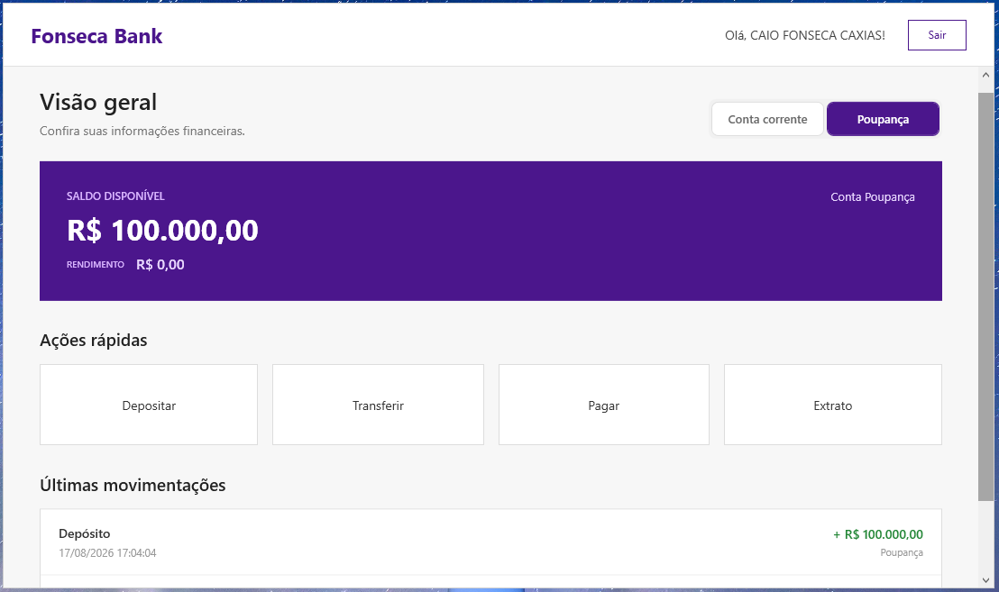
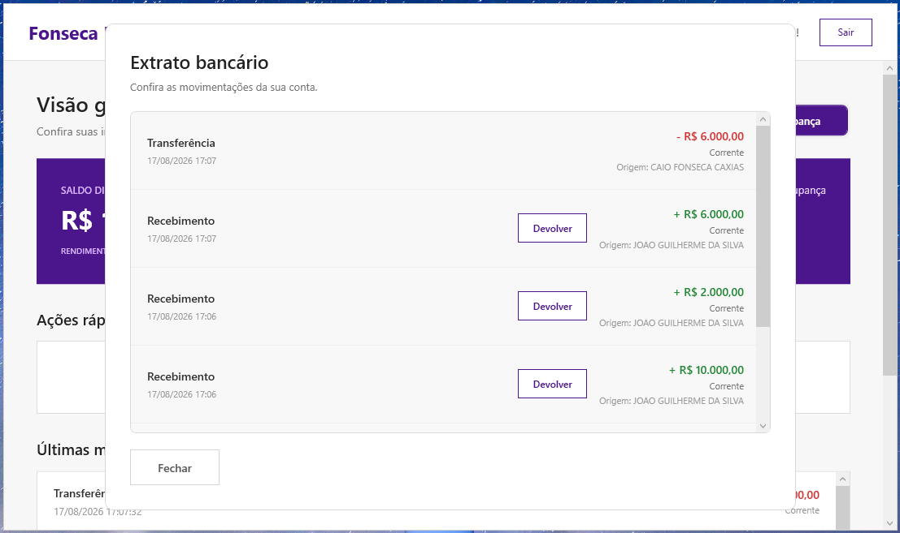

# Sistema Bancário

Desenvolvi um sistema bancário simples utilizando C# e WPF para praticar e aprimorar meus conhecimentos durante meu curso.

## Funcionalidades

* Transferências
* Pagamentos
* Extrato bancário
* Operações bancárias
* Interface gráfica utilizando WPF

## Tecnologias

* C#
* .NET
* WPF
* Visual Studio

## Imagens

### Tela inicial

### Transferências

### Extrato

## Sobre o projeto

Projeto desenvolvido como parte dos estudos de C# e WPF, com o objetivo de aplicar conceitos de programação e desenvolvimento de aplicações desktop.
